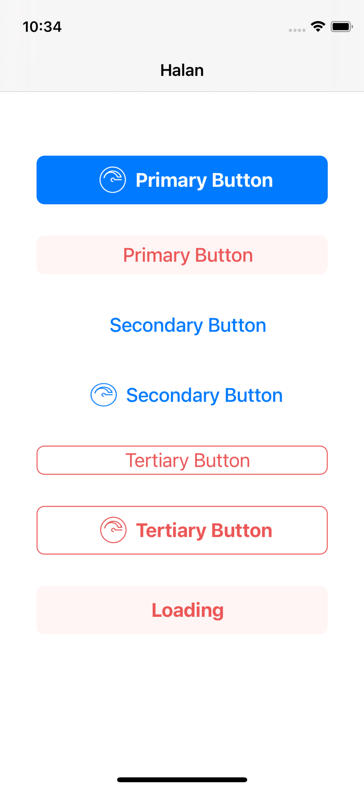
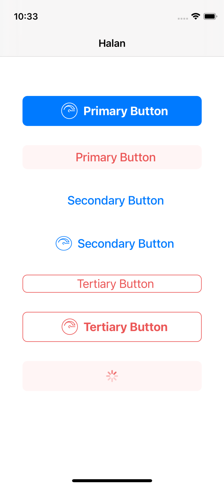
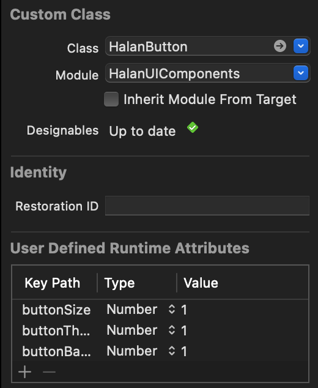
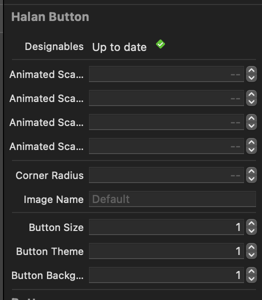

# HalanUIComponents

## How it works
The library allows you to use all the features of standard UIButton with a lot of new cool features, customizable from Storyboard or from code.

| Start Screen | Loading Screen |
| --- | --- |
|  |  |

First of all, drag & drop a new UIButton inside your view controller in storyboard, then set the UIButton class to HalanButton:

| Halan Class | Halan Inspector |
| --- | --- |
|  |  |


That's it! Now you are ready to customize your HalanButton from the `Attributes Inspector` of Interface Builder.

##### How to show the loader indicator
```
//Pass `false` to disable user interaction while loading is showed
myButton.showLoader(userInteraction: true)

//Hide loader
myButton.hideLoader()
```

## Requirements

- iOS 13.0+
- Xcode 12+

## Setup
To get started, you need to have the HalanUIComponent pod installed in your workspace. Add the following line to your Podfile and run the pod install command.

```
pod ‘HalanUIComponents’, :git => "https://github.com/Moamenzalabia/HalanUIComponents.git"
```
